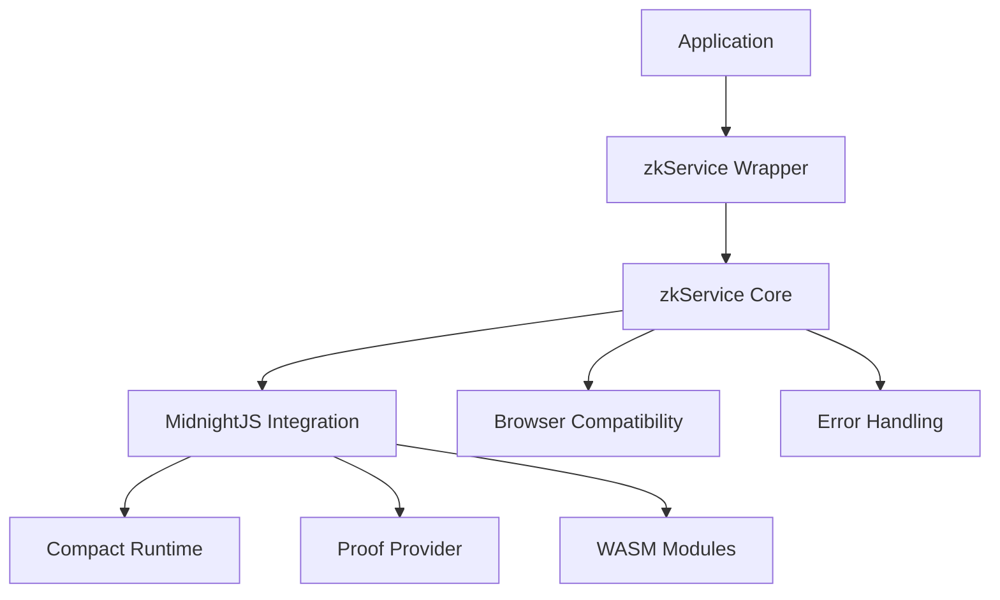

# ZK Service API Documentation

This document provides comprehensive documentation for the ZK Service API used in the ZK Circuit Editor & Proof Playground.

## Table of Contents

1. [Overview](#overview)
2. [Service Architecture](#service-architecture)
3. [Core API Methods](#core-api-methods)
4. [Data Types](#data-types)
5. [Error Handling](#error-handling)
6. [Examples](#examples)
7. [Migration Guide](#migration-guide)

## Overview

The ZK Service provides a high-level API for interacting with zero-knowledge proof functionality, including:

- Circuit compilation from Compact language
- Zero-knowledge proof generation
- Proof verification
- Service status monitoring
- Graceful degradation and fallback handling

The service automatically handles browser compatibility, WebAssembly loading, and provides both production and mock modes for development and testing.

## Service Architecture



## Core API Methods

### `generateProof(compactCode, publicInputs, privateInputs)`

Generates a complete ZK proof including compilation, proof generation, and verification.

**Signature:**
```javascript
generateProof(
  compactCode: string,
  publicInputs: object,
  privateInputs: object
): Promise<ProofResult>
```

**Parameters:**
- `compactCode` (string): Circuit code written in Compact language
- `publicInputs` (object): Public input values as JSON object
- `privateInputs` (object): Private input values as JSON object

**Returns:** `Promise<ProofResult>`

**Example:**
```javascript
import { generateProof } from './services/zkService.js';

const result = await generateProof(
  `circuit AdditionCircuit {
    public fn main(a: u32, b: u32) -> u32 {
      a + b
    }
  }`,
  { a: 5, b: 3 },
  {}
);

if (result.success) {
  console.log('Proof:', result.result.proofData);
  console.log('Output:', result.result.publicOutputs);
  console.log('Valid:', result.verification.isValid);
} else {
  console.error('Error:', result.error.message);
}
```

### `compileCircuit(compactCode)`

Compiles Compact language code into ZKIR (Zero-Knowledge Intermediate Representation).

**Signature:**
```javascript
compileCircuit(compactCode: string): Promise<CompileResult>
```

**Parameters:**
- `compactCode` (string): Circuit code to compile

**Returns:** `Promise<CompileResult>`

**Example:**
```javascript
import { compileCircuit } from './services/zkService.js';

const result = await compileCircuit(`
  circuit MultiplyCircuit {
    public fn main(x: u32, y: u32) -> u32 {
      x * y
    }
  }
`);

if (result.success) {
  console.log('Compiled ZKIR:', result.zkir);
  console.log('Code hash:', result.metadata.compactCodeHash);
} else {
  console.error('Compilation error:', result.error.message);
}
```

### `generateProofFromZKIR(zkir, publicInputs, privateInputs)`

Generates a proof from pre-compiled ZKIR.

**Signature:**
```javascript
generateProofFromZKIR(
  zkir: object,
  publicInputs: object,
  privateInputs: object
): Promise<ProofGenerationResult>
```

**Parameters:**
- `zkir` (object): Compiled circuit representation from `compileCircuit`
- `publicInputs` (object): Public input values
- `privateInputs` (object): Private input values

**Returns:** `Promise<ProofGenerationResult>`

**Example:**
```javascript
import { compileCircuit, generateProofFromZKIR } from './services/zkService.js';

// First compile
const compileResult = await compileCircuit(circuitCode);

// Then generate proof
const proofResult = await generateProofFromZKIR(
  compileResult.zkir,
  { a: 10, b: 20 },
  { secret: 42 }
);
```

### `verifyProof(proof)`

Verifies a generated proof for validity.

**Signature:**
```javascript
verifyProof(proof: object): Promise<VerificationResult>
```

**Parameters:**
- `proof` (object): Proof object to verify

**Returns:** `Promise<VerificationResult>`

**Example:**
```javascript
import { verifyProof } from './services/zkService.js';

const verification = await verifyProof(proofResult.proof);

if (verification.success) {
  console.log('Proof is valid:', verification.isValid);
  console.log('Verification metadata:', verification.metadata);
} else {
  console.error('Verification failed:', verification.error.message);
}
```

### `getServiceStatus()`

Returns current service status and configuration information.

**Signature:**
```javascript
getServiceStatus(): Promise<ServiceStatus>
```

**Returns:** `Promise<ServiceStatus>`

**Example:**
```javascript
import { getServiceStatus } from './services/zkService.js';

const status = await getServiceStatus();

console.log('Service mode:', status.mode);
console.log('Is ready:', status.isReady);
console.log('Message:', status.message);

if (status.error) {
  console.warn('Service error:', status.error);
}
```

### `getMaxField()`

Returns the maximum field value for the current ZK system.

**Signature:**
```javascript
getMaxField(): Promise<bigint>
```

**Returns:** `Promise<bigint>`

**Example:**
```javascript
import { getMaxField } from './services/zkService.js';

const maxField = await getMaxField();
console.log('Max field value:', maxField.toString());
```

## Data Types

### ProofResult

```typescript
interface ProofResult {
  success: boolean;
  result?: {
    proofData: string;
    publicOutputs: object;
    circuitHash: string;
    mockMode?: boolean;
    message?: string;
  };
  verification?: {
    isValid: boolean;
    metadata: {
      step: string;
      timestamp: string;
      proofHash: string;
      executionTime: number;
    };
  };
  metadata: {
    timestamp: string;
    compactCodeHash: string;
    publicInputsHash: string;
    totalExecutionTime: number;
  };
  error?: ErrorInfo;
}
```

### CompileResult

```typescript
interface CompileResult {
  success: boolean;
  zkir?: object;
  metadata?: {
    step: string;
    timestamp: string;
    compactCodeHash: string;
    executionTime: number;
    mode: string;
    message: string;
  };
  error?: ErrorInfo;
}
```

### ProofGenerationResult

```typescript
interface ProofGenerationResult {
  success: boolean;
  proof?: {
    proofData: string;
    publicOutputs: object;
    circuitHash: string;
    mockMode: boolean;
    message: string;
  };
  metadata?: {
    step: string;
    timestamp: string;
    publicInputsHash: string;
    privateInputsHash: string;
    executionTime: number;
  };
  error?: ErrorInfo;
}
```

### VerificationResult

```typescript
interface VerificationResult {
  success: boolean;
  isValid?: boolean;
  metadata?: {
    step: string;
    timestamp: string;
    proofHash: string;
    executionTime: number;
  };
  error?: ErrorInfo;
}
```

### ServiceStatus

```typescript
interface ServiceStatus {
  isInitialized: boolean;
  isReady: boolean;
  mode: 'production' | 'mock' | 'error' | 'initializing';
  message: string;
  error?: {
    message: string;
    type: string;
    fallbackMode?: boolean;
  };
}
```

### ErrorInfo

```typescript
interface ErrorInfo {
  message: string;
  type: string;
  timestamp: string;
  step?: string;
  executionTime?: number;
  fallbackAvailable?: boolean;
}
```

## Error Handling

The ZK Service implements comprehensive error handling with graceful degradation:

### Error Types

1. **CompilationError**: Circuit compilation failed
2. **ProofGenerationError**: Proof generation failed
3. **VerificationError**: Proof verification failed
4. **InitializationError**: Service initialization failed
5. **LibraryLoadError**: MidnightJS library loading failed
6. **ServiceError**: General service errors

### Fallback Modes

1. **Production Mode**: Full MidnightJS functionality
2. **Mock Mode**: Simulated ZK operations for demonstration
3. **Demo Mode**: User-activated fallback mode
4. **Error Mode**: Service unavailable with error details

### Error Response Format

All API methods return consistent error responses:

```javascript
{
  success: false,
  error: {
    message: "Human-readable error message",
    type: "ErrorType",
    timestamp: "2024-01-01T00:00:00.000Z",
    step: "compile|generate|verify",
    fallbackAvailable: true
  }
}
```

### Handling Errors

```javascript
const result = await generateProof(code, publicInputs, privateInputs);

if (!result.success) {
  switch (result.error.type) {
    case 'CompilationError':
      console.log('Fix your circuit code');
      break;
    case 'LibraryLoadError':
      console.log('Enable demo mode or check browser compatibility');
      break;
    default:
      console.log('General error:', result.error.message);
  }
}
```

## Examples

### Basic Proof Generation Workflow

```javascript
import { generateProof } from './services/zkService.js';

async function basicWorkflow() {
  const circuitCode = `
    circuit ExampleCircuit {
      public fn main(input: u32) -> u32 {
        input * 2
      }
    }
  `;
  
  const publicInputs = { input: 21 };
  const privateInputs = {};
  
  try {
    const result = await generateProof(circuitCode, publicInputs, privateInputs);
    
    if (result.success) {
      console.log('✅ Proof generated successfully');
      console.log('Proof data:', result.result.proofData);
      console.log('Public outputs:', result.result.publicOutputs);
      console.log('Proof is valid:', result.verification.isValid);
    } else {
      console.error('❌ Proof generation failed:', result.error.message);
    }
  } catch (error) {
    console.error('💥 Unexpected error:', error);
  }
}
```

### Step-by-Step Workflow

```javascript
import { 
  compileCircuit, 
  generateProofFromZKIR, 
  verifyProof 
} from './services/zkService.js';

async function stepByStepWorkflow() {
  const circuitCode = `
    circuit HashCircuit {
      public fn main(preimage: u32) -> u32 {
        // Simple hash simulation
        preimage ^ 0xDEADBEEF
      }
    }
  `;
  
  // Step 1: Compile
  console.log('🔨 Compiling circuit...');
  const compileResult = await compileCircuit(circuitCode);
  
  if (!compileResult.success) {
    throw new Error(`Compilation failed: ${compileResult.error.message}`);
  }
  
  console.log('✅ Circuit compiled successfully');
  
  // Step 2: Generate proof
  console.log('⚡ Generating proof...');
  const proofResult = await generateProofFromZKIR(
    compileResult.zkir,
    { preimage: 12345 },
    {}
  );
  
  if (!proofResult.success) {
    throw new Error(`Proof generation failed: ${proofResult.error.message}`);
  }
  
  console.log('✅ Proof generated successfully');
  
  // Step 3: Verify proof
  console.log('🔍 Verifying proof...');
  const verifyResult = await verifyProof(proofResult.proof);
  
  if (!verifyResult.success) {
    throw new Error(`Verification failed: ${verifyResult.error.message}`);
  }
  
  console.log('✅ Proof verified:', verifyResult.isValid ? 'VALID' : 'INVALID');
  
  return {
    compilation: compileResult,
    proof: proofResult,
    verification: verifyResult
  };
}
```

### Service Status Monitoring

```javascript
import { getServiceStatus } from './services/zkService.js';

async function monitorService() {
  const status = await getServiceStatus();
  
  console.log(`Service Status: ${status.mode.toUpperCase()}`);
  console.log(`Ready: ${status.isReady ? '✅' : '❌'}`);
  console.log(`Message: ${status.message}`);
  
  switch (status.mode) {
    case 'production':
      console.log('🚀 Full ZK functionality available');
      break;
    case 'mock':
      console.log('🎭 Running in demonstration mode');
      break;
    case 'error':
      console.log('💥 Service error:', status.error?.message);
      break;
    case 'initializing':
      console.log('⏳ Service is starting up...');
      break;
  }
}

// Monitor service periodically
setInterval(monitorService, 30000); // Every 30 seconds
```

### Advanced Circuit with Private Inputs

```javascript
async function advancedCircuitExample() {
  const circuitCode = `
    circuit PrivateAdditionCircuit {
      public fn main(public_value: u32, private_addend: u32) -> u32 {
        public_value + private_addend
      }
    }
  `;
  
  const publicInputs = { public_value: 10 };
  const privateInputs = { private_addend: 42 }; // Secret value
  
  const result = await generateProof(circuitCode, publicInputs, privateInputs);
  
  if (result.success) {
    console.log('Public inputs were:', publicInputs);
    console.log('Private inputs remain secret!');
    console.log('Computed result:', result.result.publicOutputs);
    console.log('Proof validates without revealing private_addend');
  }
}
```

### Error Handling Best Practices

```javascript
import { generateProof, getServiceStatus } from './services/zkService.js';

async function robustProofGeneration(code, publicInputs, privateInputs) {
  try {
    // Check service status first
    const status = await getServiceStatus();
    
    if (!status.isReady && status.mode === 'error') {
      throw new Error(`Service unavailable: ${status.error?.message}`);
    }
    
    // Generate proof with retries
    let attempts = 0;
    const maxAttempts = 3;
    
    while (attempts < maxAttempts) {
      const result = await generateProof(code, publicInputs, privateInputs);
      
      if (result.success) {
        return result;
      }
      
      // Check if error is retryable
      if (result.error.type === 'LibraryLoadError' && attempts < maxAttempts - 1) {
        console.log(`Attempt ${attempts + 1} failed, retrying...`);
        await new Promise(resolve => setTimeout(resolve, 1000 * (attempts + 1)));
        attempts++;
        continue;
      }
      
      // Non-retryable error or max attempts reached
      throw new Error(result.error.message);
    }
  } catch (error) {
    console.error('Proof generation failed after retries:', error.message);
    
    // Activate demo mode as fallback
    localStorage.setItem('zkDemoMode', 'true');
    console.log('Activated demo mode for continued functionality');
    
    throw error;
  }
}
```

## Migration Guide

### From v1.0 to v2.0

**Breaking Changes:**
- `generateProof()` now returns verification results inline
- Error responses include `fallbackAvailable` flag
- Service status includes `mode` field instead of boolean flags

**Migration Steps:**

1. **Update error handling:**
   ```javascript
   // Old
   if (result.error) {
     console.error(result.error);
   }
   
   // New
   if (!result.success) {
     console.error(result.error.message);
     if (result.error.fallbackAvailable) {
       // Handle fallback mode
     }
   }
   ```

2. **Update service status checks:**
   ```javascript
   // Old
   const status = await getServiceStatus();
   if (status.available) {
     // Service ready
   }
   
   // New
   const status = await getServiceStatus();
   if (status.mode === 'production' && status.isReady) {
     // Service ready
   }
   ```

3. **Handle new verification format:**
   ```javascript
   // Old
   const proof = await generateProof(...);
   const verification = await verifyProof(proof.result);
   
   // New
   const result = await generateProof(...);
   const isValid = result.verification?.isValid;
   ```

---

For more examples and advanced usage patterns, see the [User Guide](./USER_GUIDE.md) and [integration tests](../src/services/__tests__/).